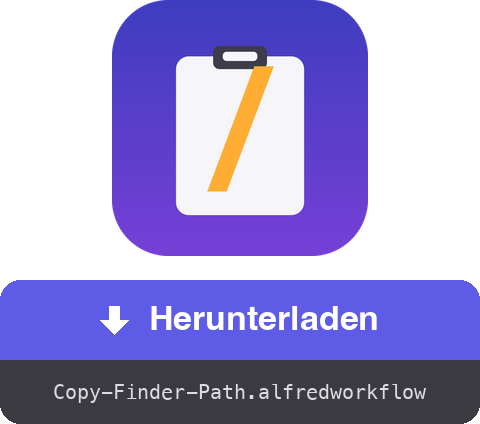

<a href="dist/Copy-Finder-Path.alfredworkflow?raw=true"></a>

<table>
  <tr><td align="center"><a href="README.md"></a><br><a href="README.md"><sub>English</sub></a></td><td align="center"><a href="README.fr.md"></a><br><a href="README.fr.md"><sub>Français</sub></a></td><td align="center"><a href="README.es.md"></a><br><a href="README.es.md"><sub>Español</sub></a></td><td align="center"><a href="README.it.md"></a><br><a href="README.it.md"><sub>Italiano</sub></a></td><td align="center"><a href="README.pt.md"></a><br><a href="README.pt.md"><sub>Português</sub></a></td><td align="center"><a href="README.ja.md"></a><br><a href="README.ja.md"><sub>日本語</sub></a></td><td align="center"><a href="README.zh.md"></a><br><a href="README.zh.md"><sub>中文</sub></a></td><td align="center"><a href="README.el.md"></a><br><a href="README.el.md"><sub>Ελληνικά</sub></a></td></tr>
</table>

###### ALFRED WORKFLOW
# Vollständigen Pfad aus dem Finder kopieren

**Ein Hotkey. Der vollständige Pfad deiner Finder-Auswahl, direkt in der Zwischenablage.**

Kein Rechtsklick → ⌥ halten → „Als Pfadname kopieren“ suchen mehr. Auswählen, **⇧⌘C** drücken, einfügen.


## ✨ Was es tut

- **Ein Element** → kopiert den absoluten Pfad, z. B. `/Users/you/Projects/report.pdf`
- **Mehrere Elemente** → ein Pfad pro Zeile, bereit für ein Skript oder das Terminal
- **Nichts ausgewählt** → kopiert den Ordner des vordersten Finder-Fensters (praktisch für ein schnelles `cd`)
- **Saubere Ausgabe** → kein abschließendes `/` bei Ordnern
- **Sofortiges Feedback** → eine Mitteilung zeigt, was kopiert wurde – in deiner macOS-Sprache (Englisch, Französisch, Deutsch, Spanisch, Italienisch, Portugiesisch, Japanisch, Chinesisch, Griechisch)

## 🚀 Installation

1. `Copy-Finder-Path.alfredworkflow` herunterladen und doppelklicken
2. Standard-Hotkey ist **⇧⌘C** – zum Ändern den Hotkey-Block in Alfred doppelklicken
3. Beim ersten Einsatz Alfred erlauben, den Finder zu steuern, wenn macOS fragt (Systemeinstellungen → Datenschutz & Sicherheit → Automation)

Benötigt [Alfred 5](https://www.alfredapp.com) mit [Powerpack](https://www.alfredapp.com/powerpack/), macOS 12 oder neuer.

## 🔧 So funktioniert es


Ein AppleScript fragt den Finder nach der Auswahl, ein paar Zeilen Bash bereinigen die Pfade, und Alfred legt das Ergebnis in die Zwischenablage. Keine Abhängigkeiten – läuft auf jedem Standard-macOS.

Der Workflow stellt außerdem einen [**External Trigger**](https://www.alfredapp.com/help/workflows/triggers/external/) namens `copy-path` bereit, um ihn von überall auszulösen:

```applescript
tell application id "com.runningwithcrayons.Alfred" to run trigger "copy-path" in workflow "dev.gotan.alfred.copyfinderpath"
```

## 🛠 Entwicklung

Der gesamte Workflow steckt in `tools/build.py` – `workflow/info.plist` und das `dist/Copy-Finder-Path.alfredworkflow`-Bundle werden daraus erzeugt.

```bash
./build                   # workflow/info.plist + dist/*.alfredworkflow neu erzeugen
./build --install         # …und in Alfred öffnen
tools/make-icon.py        # workflow/icon.png neu erzeugen
tools/make-readmes.py     # alle README-Dateien neu erzeugen
```

Die UIDs sind stabil, ein erneuter Import aktualisiert den bestehenden Workflow an Ort und Stelle.

**Unter der Haube** gibt der Run-Script-Block [Alfred-JSON](https://www.alfredapp.com/help/workflows/utilities/json/) aus: `{"alfredworkflow":{"arg":"<paths>","variables":{"title":"<localized title>"}}}`. `arg` füllt die Zwischenablage, `title` (aus `AppleLanguages` gewählt) die Mitteilung über `{var:title}`. Beschreibung und Readme des Workflows sind statische Metadaten und bleiben auf Englisch.

**Ideen / einfache Anpassungen**

- Shell-escapte Pfade (`Mein\ Ordner`): das letzte `sed` durch `sed -E 's/([ ()&])/\\\1/g'` ersetzen
- `file://`-URLs oder Pfade relativ zu `$HOME` (`~/…`)
- Traditionelles Chinesisch für `zh-TW` / `zh-HK` über die vollständige Locale

[](https://www.python.org) [](https://claude.com)

## 📚 Referenzen

- [Alfred](https://www.alfredapp.com) · [Powerpack](https://www.alfredapp.com/powerpack/) · [Alfred Gallery](https://alfred.app)
- [Workflow-Dokumentation](https://www.alfredapp.com/help/workflows/) — [Hotkey](https://www.alfredapp.com/help/workflows/triggers/hotkey/), [Run Script](https://www.alfredapp.com/help/workflows/actions/run-script/), [Copy to Clipboard](https://www.alfredapp.com/help/workflows/outputs/copy-to-clipboard/), [Post Notification](https://www.alfredapp.com/help/workflows/outputs/post-notification/)
- [Workflow-Variablen](https://www.alfredapp.com/help/workflows/advanced/variables/) — `{var:title}`
- [Alfred Community Forum](https://www.alfredforum.com)

## 📄 Lizenz

MIT.

---

Erstellt von <a href='https://damiencuvillier.com' target='_blank' rel='noopener'>Damien</a> · Issues und PRs willkommen

*Der Code dieses Workflows wurde mit Unterstützung eines LLM (Claude Code) generiert — entworfen und getestet von einem Menschen ;-)*
