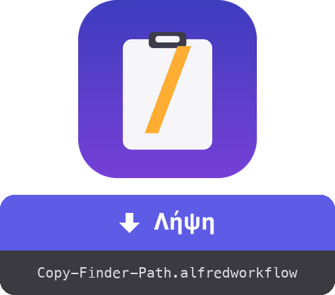

<a href="dist/Copy-Finder-Path.alfredworkflow?raw=true"></a>

<table>
  <tr><td align="center"><a href="README.md"></a><br><a href="README.md"><sub>English</sub></a></td><td align="center"><a href="README.fr.md"></a><br><a href="README.fr.md"><sub>Français</sub></a></td><td align="center"><a href="README.de.md"></a><br><a href="README.de.md"><sub>Deutsch</sub></a></td><td align="center"><a href="README.es.md"></a><br><a href="README.es.md"><sub>Español</sub></a></td><td align="center"><a href="README.it.md"></a><br><a href="README.it.md"><sub>Italiano</sub></a></td><td align="center"><a href="README.pt.md"></a><br><a href="README.pt.md"><sub>Português</sub></a></td><td align="center"><a href="README.ja.md"></a><br><a href="README.ja.md"><sub>日本語</sub></a></td><td align="center"><a href="README.zh.md"></a><br><a href="README.zh.md"><sub>中文</sub></a></td></tr>
</table>

###### ALFRED WORKFLOW
# Αντιγραφή πλήρους διαδρομής από το Finder

**Μία συντόμευση. Η πλήρης διαδρομή ό,τι έχεις επιλέξει στο Finder, κατευθείαν στο πρόχειρο.**

Τέλος το δεξί κλικ → κράτημα ⌥ → ψάξιμο για «Αντιγραφή ως όνομα διαδρομής». Επίλεξε, πάτα **⇧⌘C**, επικόλλησε.


## ✨ Τι κάνει

- **Ένα στοιχείο** → αντιγράφει την απόλυτη διαδρομή του, π.χ. `/Users/you/Projects/report.pdf`
- **Πολλά στοιχεία** → μία διαδρομή ανά γραμμή, έτοιμη για script ή τερματικό
- **Χωρίς επιλογή** → αντιγράφει τον φάκελο του μπροστινού παραθύρου Finder (βολικό για ένα γρήγορο `cd`)
- **Καθαρή έξοδος** → χωρίς `/` στο τέλος των φακέλων
- **Άμεση ανατροφοδότηση** → μια ειδοποίηση δείχνει τι αντιγράφηκε, στη γλώσσα του macOS σου (Αγγλικά, Γαλλικά, Γερμανικά, Ισπανικά, Ιταλικά, Πορτογαλικά, Ιαπωνικά, Κινεζικά, Ελληνικά)

## 🚀 Εγκατάσταση

1. Κατέβασε το `Copy-Finder-Path.alfredworkflow` και κάνε διπλό κλικ
2. Η προεπιλεγμένη συντόμευση είναι **⇧⌘C** — διπλό κλικ στο μπλοκ Hotkey στο Alfred για να την αλλάξεις
3. Στην πρώτη χρήση, επίτρεψε στο Alfred να ελέγχει το Finder όταν το ζητήσει το macOS (Ρυθμίσεις συστήματος → Απόρρητο και ασφάλεια → Αυτοματισμός)

Απαιτεί [Alfred 5](https://www.alfredapp.com) με [Powerpack](https://www.alfredapp.com/powerpack/), macOS 12 ή νεότερο.

## 🔧 Πώς λειτουργεί


Ένα AppleScript ζητά από το Finder την επιλογή, λίγες γραμμές bash καθαρίζουν τις διαδρομές και το Alfred βάζει το αποτέλεσμα στο πρόχειρο. Χωρίς εξαρτήσεις — τρέχει σε ένα καθαρό macOS.

Το workflow εκθέτει επίσης ένα [**External Trigger**](https://www.alfredapp.com/help/workflows/triggers/external/) με όνομα `copy-path`, ώστε να το ενεργοποιείς από οπουδήποτε:

```applescript
tell application id "com.runningwithcrayons.Alfred" to run trigger "copy-path" in workflow "dev.gotan.alfred.copyfinderpath"
```

## 🛠 Ανάπτυξη

Ολόκληρο το workflow βρίσκεται στο `tools/build.py` — το `workflow/info.plist` και το πακέτο `dist/Copy-Finder-Path.alfredworkflow` παράγονται από αυτό.

```bash
tools/build.py            # αναδημιουργεί workflow/info.plist + dist/*.alfredworkflow
tools/build.py --install  # …και το ανοίγει στο Alfred
tools/make-icon.py        # αναδημιουργεί το workflow/icon.png
tools/make-readmes.py     # αναδημιουργεί όλα τα README
```

Τα UID είναι σταθερά, οπότε η επανεισαγωγή ενημερώνει το υπάρχον workflow επιτόπου.

**Στο παρασκήνιο**, το μπλοκ Run Script παράγει [JSON του Alfred](https://www.alfredapp.com/help/workflows/utilities/json/): `{"alfredworkflow":{"arg":"<paths>","variables":{"title":"<localized title>"}}}`. Το `arg` τροφοδοτεί το πρόχειρο, το `title` (επιλεγμένο από το `AppleLanguages`) την ειδοποίηση μέσω `{var:title}`. Η περιγραφή και το readme του workflow είναι στατικά μεταδεδομένα και παραμένουν στα Αγγλικά.

**Ιδέες / εύκολες παραλλαγές**

- Διαδρομές με escape για shell (`My\ Folder`): αντικατάστησε το τελευταίο `sed` με `sed -E 's/([ ()&])/\\\1/g'`
- `file://` URL, ή διαδρομές σχετικές με το `$HOME` (`~/…`)
- Παραδοσιακά Κινεζικά για `zh-TW` / `zh-HK` ελέγχοντας ολόκληρο το locale

## 📚 Αναφορές

- [Alfred](https://www.alfredapp.com) · [Powerpack](https://www.alfredapp.com/powerpack/) · [Alfred Gallery](https://alfred.app)
- [Τεκμηρίωση workflows](https://www.alfredapp.com/help/workflows/) — [Hotkey](https://www.alfredapp.com/help/workflows/triggers/hotkey/), [Run Script](https://www.alfredapp.com/help/workflows/actions/run-script/), [Copy to Clipboard](https://www.alfredapp.com/help/workflows/outputs/copy-to-clipboard/), [Post Notification](https://www.alfredapp.com/help/workflows/outputs/post-notification/)
- [Μεταβλητές workflow](https://www.alfredapp.com/help/workflows/advanced/variables/) — `{var:title}`
- [Φόρουμ κοινότητας Alfred](https://www.alfredforum.com)

## 📄 Άδεια

MIT.

---

Από τον <a href='https://damiencuvillier.com' target='_blank' rel='noopener'>Damien</a> · Issues και PRs ευπρόσδεκτα
