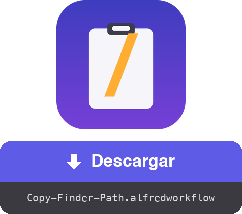

<a href="dist/Copy-Finder-Path.alfredworkflow?raw=true"></a>

<table>
  <tr><td align="center"><a href="README.md"></a><br><a href="README.md"><sub>English</sub></a></td><td align="center"><a href="README.fr.md"></a><br><a href="README.fr.md"><sub>Français</sub></a></td><td align="center"><a href="README.de.md"></a><br><a href="README.de.md"><sub>Deutsch</sub></a></td><td align="center"><a href="README.it.md"></a><br><a href="README.it.md"><sub>Italiano</sub></a></td><td align="center"><a href="README.pt.md"></a><br><a href="README.pt.md"><sub>Português</sub></a></td><td align="center"><a href="README.ja.md"></a><br><a href="README.ja.md"><sub>日本語</sub></a></td><td align="center"><a href="README.zh.md"></a><br><a href="README.zh.md"><sub>中文</sub></a></td><td align="center"><a href="README.el.md"></a><br><a href="README.el.md"><sub>Ελληνικά</sub></a></td></tr>
</table>

###### ALFRED WORKFLOW
# Copiar la ruta completa desde el Finder

**Un atajo. La ruta completa de lo que tengas seleccionado en el Finder, directa al portapapeles.**

Se acabó el clic derecho → mantener ⌥ → buscar «Copiar como nombre de ruta». Selecciona, pulsa **⇧⌘C**, pega.


## ✨ Qué hace

- **Un elemento** → copia su ruta absoluta, p. ej. `/Users/you/Projects/report.pdf`
- **Varios elementos** → una ruta por línea, lista para un script o el terminal
- **Sin selección** → copia la carpeta de la ventana del Finder en primer plano (útil para un `cd` rápido)
- **Salida limpia** → sin `/` final en las carpetas
- **Respuesta inmediata** → una notificación muestra lo copiado, en el idioma de tu macOS (inglés, francés, alemán, español, italiano, portugués, japonés, chino, griego)

## 🚀 Instalación

1. Descarga `Copy-Finder-Path.alfredworkflow` y haz doble clic
2. El atajo por defecto es **⇧⌘C**; haz doble clic en el bloque Hotkey de Alfred para cambiarlo
3. La primera vez, permite que Alfred controle el Finder cuando macOS lo pida (Ajustes del Sistema → Privacidad y seguridad → Automatización)

Requiere [Alfred 5](https://www.alfredapp.com) con el [Powerpack](https://www.alfredapp.com/powerpack/), macOS 12 o posterior.

## 🔧 Cómo funciona


Un AppleScript pide al Finder su selección, unas líneas de bash limpian las rutas y Alfred deja el resultado en el portapapeles. Sin dependencias: funciona en un macOS estándar.

El workflow también expone un [**External Trigger**](https://www.alfredapp.com/help/workflows/triggers/external/) llamado `copy-path`, para lanzarlo desde cualquier sitio:

```applescript
tell application id "com.runningwithcrayons.Alfred" to run trigger "copy-path" in workflow "dev.gotan.alfred.copyfinderpath"
```

## 🛠 Desarrollo

Todo el workflow vive en `tools/build.py`: `workflow/info.plist` y el paquete `dist/Copy-Finder-Path.alfredworkflow` se generan a partir de él.

```bash
./build                   # regenera workflow/info.plist + dist/*.alfredworkflow
./build --install         # …y lo abre en Alfred
tools/make-icon.py        # regenera workflow/icon.png
tools/make-readmes.py     # regenera todos los README
```

Los UIDs son estables, así que reimportar actualiza el workflow existente en su sitio.

**Por dentro**, el bloque Run Script emite [JSON de Alfred](https://www.alfredapp.com/help/workflows/utilities/json/): `{"alfredworkflow":{"arg":"<paths>","variables":{"title":"<localized title>"}}}`. `arg` alimenta el portapapeles y `title` (elegido según `AppleLanguages`) la notificación mediante `{var:title}`. La descripción y el readme del workflow son metadatos estáticos y se quedan en inglés.

**Ideas / ajustes fáciles**

- Rutas escapadas para shell (`Mi\ Carpeta`): sustituye el `sed` final por `sed -E 's/([ ()&])/\\\1/g'`
- URLs `file://`, o rutas relativas a `$HOME` (`~/…`)
- Chino tradicional para `zh-TW` / `zh-HK` comprobando la locale completa

[](https://www.python.org) [](https://claude.com)

## 📚 Referencias

- [Alfred](https://www.alfredapp.com) · [Powerpack](https://www.alfredapp.com/powerpack/) · [Alfred Gallery](https://alfred.app)
- [Documentación de workflows](https://www.alfredapp.com/help/workflows/) — [Hotkey](https://www.alfredapp.com/help/workflows/triggers/hotkey/), [Run Script](https://www.alfredapp.com/help/workflows/actions/run-script/), [Copy to Clipboard](https://www.alfredapp.com/help/workflows/outputs/copy-to-clipboard/), [Post Notification](https://www.alfredapp.com/help/workflows/outputs/post-notification/)
- [Variables de workflow](https://www.alfredapp.com/help/workflows/advanced/variables/) — `{var:title}`
- [Foro de la comunidad Alfred](https://www.alfredforum.com)

## 📄 Licencia

MIT.

---

Hecho por <a href='https://damiencuvillier.com' target='_blank' rel='noopener'>Damien</a> · Issues y PRs bienvenidos

*El código de este workflow se generó con la ayuda de un LLM (Claude Code) — diseñado y probado por un humano ;-)*
