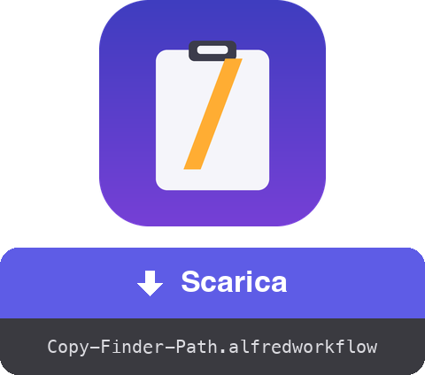

<a href="dist/Copy-Finder-Path.alfredworkflow?raw=true"></a>

<table>
  <tr><td align="center"><a href="README.md"></a><br><a href="README.md"><sub>English</sub></a></td><td align="center"><a href="README.fr.md"></a><br><a href="README.fr.md"><sub>Français</sub></a></td><td align="center"><a href="README.de.md"></a><br><a href="README.de.md"><sub>Deutsch</sub></a></td><td align="center"><a href="README.es.md"></a><br><a href="README.es.md"><sub>Español</sub></a></td><td align="center"><a href="README.pt.md"></a><br><a href="README.pt.md"><sub>Português</sub></a></td><td align="center"><a href="README.ja.md"></a><br><a href="README.ja.md"><sub>日本語</sub></a></td><td align="center"><a href="README.zh.md"></a><br><a href="README.zh.md"><sub>中文</sub></a></td><td align="center"><a href="README.el.md"></a><br><a href="README.el.md"><sub>Ελληνικά</sub></a></td></tr>
</table>

###### ALFRED WORKFLOW
# Copia il percorso completo dal Finder

**Una scorciatoia. Il percorso completo di ciò che hai selezionato nel Finder, direttamente negli appunti.**

Basta clic destro → tenere ⌥ → cercare «Copia come percorso». Seleziona, premi **⇧⌘C**, incolla.


## ✨ Cosa fa

- **Un elemento** → copia il suo percorso assoluto, es. `/Users/you/Projects/report.pdf`
- **Più elementi** → un percorso per riga, pronto per uno script o il terminale
- **Nessuna selezione** → copia la cartella della finestra Finder in primo piano (comodo per un `cd` al volo)
- **Output pulito** → nessun `/` finale sulle cartelle
- **Feedback immediato** → una notifica mostra cosa è stato copiato, nella lingua del tuo macOS (inglese, francese, tedesco, spagnolo, italiano, portoghese, giapponese, cinese, greco)

## 🚀 Installazione

1. Scarica `Copy-Finder-Path.alfredworkflow` e fai doppio clic
2. La scorciatoia predefinita è **⇧⌘C**: fai doppio clic sul blocco Hotkey in Alfred per cambiarla
3. Al primo utilizzo, consenti ad Alfred di controllare il Finder quando macOS lo chiede (Impostazioni di Sistema → Privacy e sicurezza → Automazione)

Richiede [Alfred 5](https://www.alfredapp.com) con il [Powerpack](https://www.alfredapp.com/powerpack/), macOS 12 o successivo.

## 🔧 Come funziona


Un AppleScript chiede al Finder la selezione, poche righe di bash ripuliscono i percorsi e Alfred mette il risultato negli appunti. Nessuna dipendenza: funziona su un macOS standard.

Il workflow espone anche un [**External Trigger**](https://www.alfredapp.com/help/workflows/triggers/external/) chiamato `copy-path`, per lanciarlo da qualsiasi punto:

```applescript
tell application id "com.runningwithcrayons.Alfred" to run trigger "copy-path" in workflow "dev.gotan.alfred.copyfinderpath"
```

## 🛠 Sviluppo

Tutto il workflow è in `tools/build.py`: `workflow/info.plist` e il bundle `dist/Copy-Finder-Path.alfredworkflow` vengono generati da lì.

```bash
./build                   # rigenera workflow/info.plist + dist/*.alfredworkflow
./build --install         # …e lo apre in Alfred
tools/make-icon.py        # rigenera workflow/icon.png
tools/make-readmes.py     # rigenera tutti i README
```

Gli UID sono stabili, quindi reimportare aggiorna il workflow esistente sul posto.

**Sotto il cofano**, il blocco Run Script emette [JSON Alfred](https://www.alfredapp.com/help/workflows/utilities/json/): `{"alfredworkflow":{"arg":"<paths>","variables":{"title":"<localized title>"}}}`. `arg` alimenta gli appunti, `title` (scelto da `AppleLanguages`) alimenta la notifica tramite `{var:title}`. Descrizione e readme del workflow sono metadati statici e restano in inglese.

**Idee / modifiche facili**

- Percorsi con escape per la shell (`Mia\ Cartella`): sostituisci il `sed` finale con `sed -E 's/([ ()&])/\\\1/g'`
- URL `file://`, oppure percorsi relativi a `$HOME` (`~/…`)
- Cinese tradizionale per `zh-TW` / `zh-HK` controllando la locale completa

[](https://www.python.org) [](https://claude.com)

## 📚 Riferimenti

- [Alfred](https://www.alfredapp.com) · [Powerpack](https://www.alfredapp.com/powerpack/) · [Alfred Gallery](https://alfred.app)
- [Documentazione dei workflow](https://www.alfredapp.com/help/workflows/) — [Hotkey](https://www.alfredapp.com/help/workflows/triggers/hotkey/), [Run Script](https://www.alfredapp.com/help/workflows/actions/run-script/), [Copy to Clipboard](https://www.alfredapp.com/help/workflows/outputs/copy-to-clipboard/), [Post Notification](https://www.alfredapp.com/help/workflows/outputs/post-notification/)
- [Variabili di workflow](https://www.alfredapp.com/help/workflows/advanced/variables/) — `{var:title}`
- [Forum della community Alfred](https://www.alfredforum.com)

## 📄 Licenza

MIT.

---

Realizzato da <a href='https://damiencuvillier.com' target='_blank' rel='noopener'>Damien</a> · Issue e PR benvenute

*Il codice di questo workflow è stato generato con l'aiuto di un LLM (Claude Code) — progettato e testato da un essere umano ;-)*
