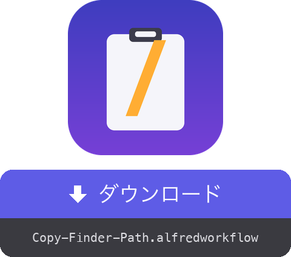

<a href="dist/Copy-Finder-Path.alfredworkflow?raw=true"></a>

<table>
  <tr><td align="center"><a href="README.md"></a><br><a href="README.md"><sub>English</sub></a></td><td align="center"><a href="README.fr.md"></a><br><a href="README.fr.md"><sub>Français</sub></a></td><td align="center"><a href="README.de.md"></a><br><a href="README.de.md"><sub>Deutsch</sub></a></td><td align="center"><a href="README.es.md"></a><br><a href="README.es.md"><sub>Español</sub></a></td><td align="center"><a href="README.it.md"></a><br><a href="README.it.md"><sub>Italiano</sub></a></td><td align="center"><a href="README.pt.md"></a><br><a href="README.pt.md"><sub>Português</sub></a></td><td align="center"><a href="README.zh.md"></a><br><a href="README.zh.md"><sub>中文</sub></a></td><td align="center"><a href="README.el.md"></a><br><a href="README.el.md"><sub>Ελληνικά</sub></a></td></tr>
</table>

###### ALFRED WORKFLOW
# Finder からフルパスをコピー

**ホットキーひとつ。Finder で選択した項目のフルパスを、そのままクリップボードへ。**

右クリック → ⌥ を押しながら → 「パス名をコピー」を探す、はもう不要。選択して **⇧⌘C**、貼り付けるだけ。


## ✨ できること

- **1 項目** → 絶対パスをコピーします。例： `/Users/you/Projects/report.pdf`
- **複数項目** → 1 行に 1 パス。スクリプトやターミナルにそのまま貼れます
- **選択なし** → 最前面の Finder ウインドウのフォルダをコピー（サッと `cd` するのに便利）
- **きれいな出力** → フォルダ末尾の `/` は付きません
- **すぐにフィードバック** → コピーした内容を通知で表示。macOS の言語に合わせます（英語・フランス語・ドイツ語・スペイン語・イタリア語・ポルトガル語・日本語・中国語・ギリシャ語）

## 🚀 インストール

1. `Copy-Finder-Path.alfredworkflow` をダウンロードしてダブルクリック
2. デフォルトのホットキーは **⇧⌘C**。変更は Alfred の Hotkey ブロックをダブルクリック
3. 初回使用時、macOS の確認で Alfred による Finder の制御を許可（システム設定 → プライバシーとセキュリティ → オートメーション）

[Alfred 5](https://www.alfredapp.com) と [Powerpack](https://www.alfredapp.com/powerpack/)、macOS 12 以降が必要です。

## 🔧 仕組み


AppleScript が Finder に選択項目を問い合わせ、数行の bash がパスを整え、Alfred が結果をクリップボードに入れます。依存なし。素の macOS で動きます。

`copy-path` という名前の [**External Trigger**](https://www.alfredapp.com/help/workflows/triggers/external/) も用意しているので、どこからでも呼び出せます：

```applescript
tell application id "com.runningwithcrayons.Alfred" to run trigger "copy-path" in workflow "dev.gotan.alfred.copyfinderpath"
```

## 🛠 開発

ワークフロー全体は `tools/build.py` にあります。`workflow/info.plist` と `dist/Copy-Finder-Path.alfredworkflow` バンドルはそこから生成されます。

```bash
./build                   # workflow/info.plist + dist/*.alfredworkflow を再生成
./build --install         # …さらに Alfred で開く
tools/make-icon.py        # workflow/icon.png を再生成
tools/make-readmes.py     # README をすべて再生成
```

UID は固定なので、再インポートすると既存のワークフローがその場で更新されます。

**内部では**、Run Script ブロックが [Alfred の JSON 形式](https://www.alfredapp.com/help/workflows/utilities/json/)を出力します：`{"alfredworkflow":{"arg":"<paths>","variables":{"title":"<localized title>"}}}`。`arg` はクリップボードへ、`title`（`AppleLanguages` から選択）は `{var:title}` 経由で通知へ渡されます。ワークフローの説明と readme は静的なメタデータのため英語のままです。

**アイデア / 簡単なカスタマイズ**

- シェル用にエスケープしたパス（`My\ Folder`）：最後の `sed` を `sed -E 's/([ ()&])/\\\1/g'` に置き換え
- `file://` URL、または `$HOME` からの相対パス（`~/…`）
- `zh-TW` / `zh-HK` はロケール全体を判定して繁体字中国語に

[](https://www.python.org) [](https://claude.com)

## 📚 参考リンク

- [Alfred](https://www.alfredapp.com) · [Powerpack](https://www.alfredapp.com/powerpack/) · [Alfred Gallery](https://alfred.app)
- [ワークフローのドキュメント](https://www.alfredapp.com/help/workflows/) — [Hotkey](https://www.alfredapp.com/help/workflows/triggers/hotkey/), [Run Script](https://www.alfredapp.com/help/workflows/actions/run-script/), [Copy to Clipboard](https://www.alfredapp.com/help/workflows/outputs/copy-to-clipboard/), [Post Notification](https://www.alfredapp.com/help/workflows/outputs/post-notification/)
- [ワークフロー変数](https://www.alfredapp.com/help/workflows/advanced/variables/) — `{var:title}`
- [Alfred コミュニティフォーラム](https://www.alfredforum.com)

## 📄 ライセンス

MIT.

---

作者：<a href='https://damiencuvillier.com' target='_blank' rel='noopener'>Damien</a> · Issue や PR を歓迎します

*このワークフローのコードは LLM（Claude Code）の支援を受けて生成されましたが、設計とテストは人間が行っています ;-)*
