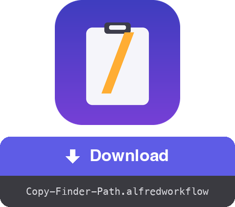

<a href="dist/Copy-Finder-Path.alfredworkflow?raw=true"></a>

<table>
  <tr><td align="center"><a href="README.fr.md"></a><br><a href="README.fr.md"><sub>Français</sub></a></td><td align="center"><a href="README.de.md"></a><br><a href="README.de.md"><sub>Deutsch</sub></a></td><td align="center"><a href="README.es.md"></a><br><a href="README.es.md"><sub>Español</sub></a></td><td align="center"><a href="README.it.md"></a><br><a href="README.it.md"><sub>Italiano</sub></a></td><td align="center"><a href="README.pt.md"></a><br><a href="README.pt.md"><sub>Português</sub></a></td><td align="center"><a href="README.ja.md"></a><br><a href="README.ja.md"><sub>日本語</sub></a></td><td align="center"><a href="README.zh.md"></a><br><a href="README.zh.md"><sub>中文</sub></a></td><td align="center"><a href="README.el.md"></a><br><a href="README.el.md"><sub>Ελληνικά</sub></a></td></tr>
</table>

###### ALFRED WORKFLOW
# Copy fullpath from Finder

**One hotkey. The full path of whatever you have selected in Finder, straight to your clipboard.**

No more right-click → hold ⌥ → hunt for "Copy as Pathname". Select, press **⇧⌘C**, paste.


## ✨ What it does

- **Single item** → copies its absolute path, e.g. `/Users/you/Projects/report.pdf`
- **Multiple items** → one path per line, ready for a script or a terminal
- **Nothing selected** → copies the folder of the frontmost Finder window (handy for a quick `cd`)
- **Clean output** → no trailing `/` on folders
- **Instant feedback** → a notification shows what was copied, in your macOS language (English, French, German, Spanish, Italian, Portuguese, Japanese, Chinese, Greek)

## 🚀 Install

1. Download `Copy-Finder-Path.alfredworkflow` and double-click it
2. Default hotkey is **⇧⌘C** — double-click the Hotkey block in Alfred to change it
3. On first use, allow Alfred to control Finder when macOS asks (System Settings → Privacy & Security → Automation)

Requires [Alfred 5](https://www.alfredapp.com) with the [Powerpack](https://www.alfredapp.com/powerpack/), macOS 12 or later.

## 🔧 How it works


An AppleScript asks Finder for its selection, a few lines of bash tidy the paths up, and Alfred puts the result on the clipboard. No dependencies — runs on a stock macOS install.

The workflow also exposes an [**External Trigger**](https://www.alfredapp.com/help/workflows/triggers/external/) named `copy-path`, so you can fire it from anywhere:

```applescript
tell application id "com.runningwithcrayons.Alfred" to run trigger "copy-path" in workflow "dev.gotan.alfred.copyfinderpath"
```

## 🛠 Development

The whole workflow lives in `tools/build.py` — `workflow/info.plist` and `dist/Copy-Finder-Path.alfredworkflow` are generated from it.

```bash
./build                   # regenerate workflow/info.plist + dist/*.alfredworkflow
./build --install         # …and open it in Alfred
tools/make-icon.py        # regenerate workflow/icon.png
tools/make-readmes.py     # regenerate all README files
```

UIDs are stable, so re-importing updates the existing workflow in place.

**Under the hood**, the Run Script block emits [Alfred's JSON format](https://www.alfredapp.com/help/workflows/utilities/json/): `{"alfredworkflow":{"arg":"<paths>","variables":{"title":"<localized title>"}}}`. `arg` feeds the clipboard, `title` (picked from `AppleLanguages`) feeds the notification via `{var:title}`. The workflow description and readme are static metadata and stay in English.

**Ideas / easy tweaks**

- Shell-escaped paths (`My\ Folder`): swap the final `sed` for `sed -E 's/([ ()&])/\\\1/g'`
- `file://` URLs, or paths relative to `$HOME` (`~/…`)
- Traditional Chinese for `zh-TW` / `zh-HK` by matching the full locale

[](https://www.python.org) [](https://claude.com)

## 📚 References

- [Alfred](https://www.alfredapp.com) · [Powerpack](https://www.alfredapp.com/powerpack/) · [Alfred Gallery](https://alfred.app)
- [Workflows documentation](https://www.alfredapp.com/help/workflows/) — [Hotkey](https://www.alfredapp.com/help/workflows/triggers/hotkey/), [Run Script](https://www.alfredapp.com/help/workflows/actions/run-script/), [Copy to Clipboard](https://www.alfredapp.com/help/workflows/outputs/copy-to-clipboard/), [Post Notification](https://www.alfredapp.com/help/workflows/outputs/post-notification/)
- [Workflow variables](https://www.alfredapp.com/help/workflows/advanced/variables/) — `{var:title}`
- [Alfred Community Forum](https://www.alfredforum.com)

## 📄 License

MIT.

---

Made by <a href='https://damiencuvillier.com' target='_blank' rel='noopener'>Damien</a> · Issues and PRs welcome

*This workflow's code was generated with the help of an LLM (Claude Code) — designed and tested by a human ;-)*
