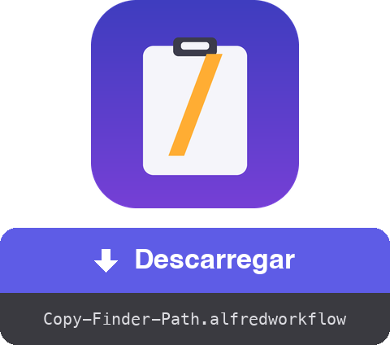

<a href="dist/Copy-Finder-Path.alfredworkflow?raw=true"></a>

<table>
  <tr><td align="center"><a href="README.md"></a><br><a href="README.md"><sub>English</sub></a></td><td align="center"><a href="README.fr.md"></a><br><a href="README.fr.md"><sub>Français</sub></a></td><td align="center"><a href="README.de.md"></a><br><a href="README.de.md"><sub>Deutsch</sub></a></td><td align="center"><a href="README.es.md"></a><br><a href="README.es.md"><sub>Español</sub></a></td><td align="center"><a href="README.it.md"></a><br><a href="README.it.md"><sub>Italiano</sub></a></td><td align="center"><a href="README.ja.md"></a><br><a href="README.ja.md"><sub>日本語</sub></a></td><td align="center"><a href="README.zh.md"></a><br><a href="README.zh.md"><sub>中文</sub></a></td><td align="center"><a href="README.el.md"></a><br><a href="README.el.md"><sub>Ελληνικά</sub></a></td></tr>
</table>

###### ALFRED WORKFLOW
# Copiar o caminho completo do Finder

**Um atalho. O caminho completo do que tiveres selecionado no Finder, direto para a área de transferência.**

Acabou o clique direito → manter ⌥ → procurar «Copiar como nome de caminho». Seleciona, prime **⇧⌘C**, cola.


## ✨ O que faz

- **Um item** → copia o seu caminho absoluto, p. ex. `/Users/you/Projects/report.pdf`
- **Vários itens** → um caminho por linha, pronto para um script ou o terminal
- **Sem seleção** → copia a pasta da janela do Finder em primeiro plano (útil para um `cd` rápido)
- **Saída limpa** → sem `/` final nas pastas
- **Feedback imediato** → uma notificação mostra o que foi copiado, no idioma do teu macOS (inglês, francês, alemão, espanhol, italiano, português, japonês, chinês, grego)

## 🚀 Instalação

1. Descarrega `Copy-Finder-Path.alfredworkflow` e faz duplo clique
2. O atalho predefinido é **⇧⌘C** — faz duplo clique no bloco Hotkey no Alfred para o alterar
3. Na primeira utilização, permite que o Alfred controle o Finder quando o macOS pedir (Definições do Sistema → Privacidade e Segurança → Automatização)

Requer [Alfred 5](https://www.alfredapp.com) com o [Powerpack](https://www.alfredapp.com/powerpack/), macOS 12 ou posterior.

## 🔧 Como funciona


Um AppleScript pede ao Finder a seleção, algumas linhas de bash limpam os caminhos e o Alfred coloca o resultado na área de transferência. Sem dependências — funciona num macOS de origem.

O workflow expõe também um [**External Trigger**](https://www.alfredapp.com/help/workflows/triggers/external/) chamado `copy-path`, para o disparar de qualquer lado:

```applescript
tell application id "com.runningwithcrayons.Alfred" to run trigger "copy-path" in workflow "dev.gotan.alfred.copyfinderpath"
```

## 🛠 Desenvolvimento

Todo o workflow vive em `tools/build.py` — o `workflow/info.plist` e o pacote `dist/Copy-Finder-Path.alfredworkflow` são gerados a partir dele.

```bash
./build                   # regenera workflow/info.plist + dist/*.alfredworkflow
./build --install         # …e abre-o no Alfred
tools/make-icon.py        # regenera workflow/icon.png
tools/make-readmes.py     # regenera todos os README
```

Os UIDs são estáveis, por isso reimportar atualiza o workflow existente no lugar.

**Por baixo do capô**, o bloco Run Script emite [JSON do Alfred](https://www.alfredapp.com/help/workflows/utilities/json/): `{"alfredworkflow":{"arg":"<paths>","variables":{"title":"<localized title>"}}}`. `arg` alimenta a área de transferência, `title` (escolhido a partir de `AppleLanguages`) alimenta a notificação via `{var:title}`. A descrição e o readme do workflow são metadados estáticos e ficam em inglês.

**Ideias / ajustes fáceis**

- Caminhos com escape para a shell (`Minha\ Pasta`): troca o `sed` final por `sed -E 's/([ ()&])/\\\1/g'`
- URLs `file://`, ou caminhos relativos a `$HOME` (`~/…`)
- Chinês tradicional para `zh-TW` / `zh-HK` verificando a locale completa

[](https://www.python.org) [](https://claude.com)

## 📚 Referências

- [Alfred](https://www.alfredapp.com) · [Powerpack](https://www.alfredapp.com/powerpack/) · [Alfred Gallery](https://alfred.app)
- [Documentação de workflows](https://www.alfredapp.com/help/workflows/) — [Hotkey](https://www.alfredapp.com/help/workflows/triggers/hotkey/), [Run Script](https://www.alfredapp.com/help/workflows/actions/run-script/), [Copy to Clipboard](https://www.alfredapp.com/help/workflows/outputs/copy-to-clipboard/), [Post Notification](https://www.alfredapp.com/help/workflows/outputs/post-notification/)
- [Variáveis de workflow](https://www.alfredapp.com/help/workflows/advanced/variables/) — `{var:title}`
- [Fórum da comunidade Alfred](https://www.alfredforum.com)

## 📄 Licença

MIT.

---

Feito por <a href='https://damiencuvillier.com' target='_blank' rel='noopener'>Damien</a> · Issues e PRs bem-vindos

*O código deste workflow foi gerado com a ajuda de um LLM (Claude Code) — concebido e testado por um humano ;-)*
