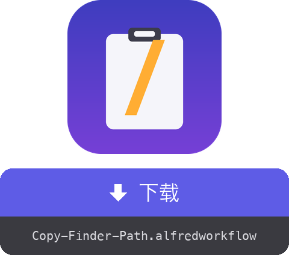

<a href="dist/Copy-Finder-Path.alfredworkflow?raw=true"></a>

<table>
  <tr><td align="center"><a href="README.md"></a><br><a href="README.md"><sub>English</sub></a></td><td align="center"><a href="README.fr.md"></a><br><a href="README.fr.md"><sub>Français</sub></a></td><td align="center"><a href="README.de.md"></a><br><a href="README.de.md"><sub>Deutsch</sub></a></td><td align="center"><a href="README.es.md"></a><br><a href="README.es.md"><sub>Español</sub></a></td><td align="center"><a href="README.it.md"></a><br><a href="README.it.md"><sub>Italiano</sub></a></td><td align="center"><a href="README.pt.md"></a><br><a href="README.pt.md"><sub>Português</sub></a></td><td align="center"><a href="README.ja.md"></a><br><a href="README.ja.md"><sub>日本語</sub></a></td><td align="center"><a href="README.el.md"></a><br><a href="README.el.md"><sub>Ελληνικά</sub></a></td></tr>
</table>

###### ALFRED WORKFLOW
# 从 Finder 复制完整路径

**一个快捷键，把 Finder 中所选项目的完整路径直接送进剪贴板。**

不用再右键 → 按住 ⌥ → 找“拷贝为路径名称”。选中，按 **⇧⌘C**，粘贴。


## ✨ 功能

- **单个项目** → 复制其绝对路径，例如 `/Users/you/Projects/report.pdf`
- **多个项目** → 每行一个路径，可直接用于脚本或终端
- **未选中任何项目** → 复制最前面 Finder 窗口所在的文件夹（快速 `cd` 很方便）
- **干净的输出** → 文件夹末尾不带 `/`
- **即时反馈** → 通知会显示复制的内容，并跟随 macOS 系统语言（英语、法语、德语、西班牙语、意大利语、葡萄牙语、日语、中文、希腊语）

## 🚀 安装

1. 下载 `Copy-Finder-Path.alfredworkflow` 并双击
2. 默认快捷键为 **⇧⌘C**，在 Alfred 中双击 Hotkey 模块即可修改
3. 首次使用时，按 macOS 提示允许 Alfred 控制 Finder（系统设置 → 隐私与安全性 → 自动化）

需要 [Alfred 5](https://www.alfredapp.com) 及 [Powerpack](https://www.alfredapp.com/powerpack/)，macOS 12 或更高版本。

## 🔧 工作原理


一段 AppleScript 向 Finder 获取选中项，几行 bash 整理路径，Alfred 把结果放入剪贴板。零依赖，原生 macOS 即可运行。

工作流还提供名为 `copy-path` 的 [**External Trigger**](https://www.alfredapp.com/help/workflows/triggers/external/)，可从任何地方触发：

```applescript
tell application id "com.runningwithcrayons.Alfred" to run trigger "copy-path" in workflow "dev.gotan.alfred.copyfinderpath"
```

## 🛠 开发

整个工作流都在 `tools/build.py` 中，`workflow/info.plist` 与 `dist/Copy-Finder-Path.alfredworkflow` 包由它生成。

```bash
./build                   # 重新生成 workflow/info.plist + dist/*.alfredworkflow
./build --install         # …并在 Alfred 中打开
tools/make-icon.py        # 重新生成 workflow/icon.png
tools/make-readmes.py     # 重新生成所有 README
```

UID 固定不变，重新导入会原地更新已有工作流。

**内部实现**：Run Script 模块输出 [Alfred JSON 格式](https://www.alfredapp.com/help/workflows/utilities/json/)：`{"alfredworkflow":{"arg":"<paths>","variables":{"title":"<localized title>"}}}`。`arg` 送入剪贴板，`title`（根据 `AppleLanguages` 选择）通过 `{var:title}` 送入通知。工作流的描述和 readme 是静态元数据，保持英文。

**想法 / 简单改动**

- Shell 转义路径（`My\ Folder`）：把最后的 `sed` 换成 `sed -E 's/([ ()&])/\\\1/g'`
- `file://` URL，或相对于 `$HOME` 的路径（`~/…`）
- 判断完整 locale，为 `zh-TW` / `zh-HK` 提供繁体中文

[](https://www.python.org) [](https://claude.com)

## 📚 参考

- [Alfred](https://www.alfredapp.com) · [Powerpack](https://www.alfredapp.com/powerpack/) · [Alfred Gallery](https://alfred.app)
- [工作流文档](https://www.alfredapp.com/help/workflows/) — [Hotkey](https://www.alfredapp.com/help/workflows/triggers/hotkey/), [Run Script](https://www.alfredapp.com/help/workflows/actions/run-script/), [Copy to Clipboard](https://www.alfredapp.com/help/workflows/outputs/copy-to-clipboard/), [Post Notification](https://www.alfredapp.com/help/workflows/outputs/post-notification/)
- [工作流变量](https://www.alfredapp.com/help/workflows/advanced/variables/) — `{var:title}`
- [Alfred 社区论坛](https://www.alfredforum.com)

## 📄 许可证

MIT.

---

作者：<a href='https://damiencuvillier.com' target='_blank' rel='noopener'>Damien</a> · 欢迎提交 Issue 和 PR

*此工作流的代码由 LLM（Claude Code）辅助生成，由人类设计和测试 ;-)*
