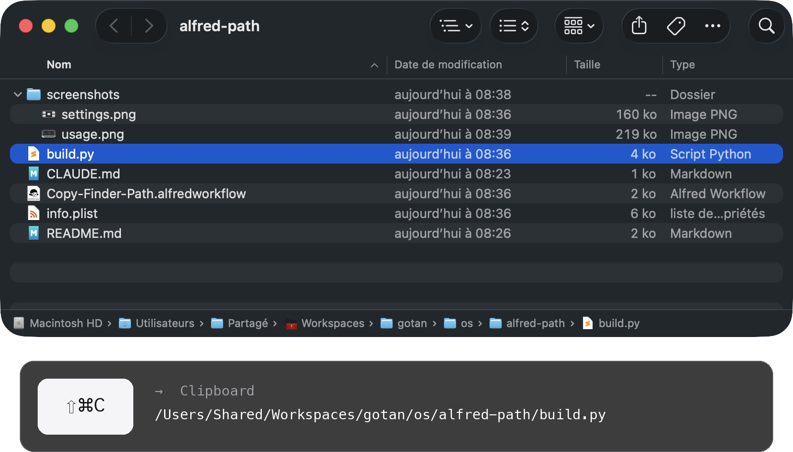
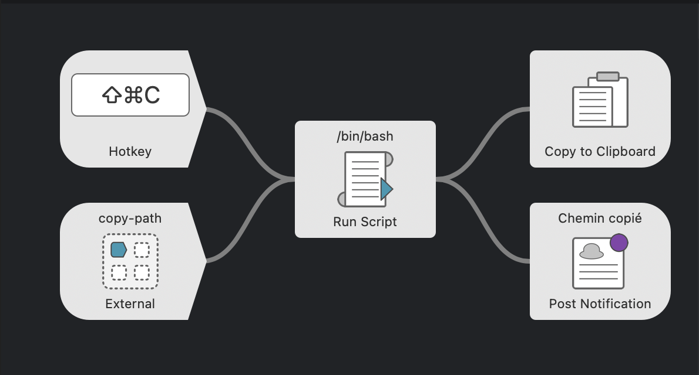

# Copy Finder Path — [Alfred](https://www.alfredapp.com) Workflow

← [概要に戻る](../README.md)

**ホットキーひとつ。Finder で選択した項目のフルパスを、そのままクリップボードへ。**

右クリック → ⌥ を押しながら → 「パス名をコピー」を探す、はもう不要。選択して **⇧⌘C**、貼り付けるだけ。



## ✨ できること

- **1 項目** → 絶対パスをコピーします。例： `/Users/you/Projects/report.pdf`
- **複数項目** → 1 行に 1 パス。スクリプトやターミナルにそのまま貼れます
- **選択なし** → 最前面の Finder ウインドウのフォルダをコピー（サッと `cd` するのに便利）
- **きれいな出力** → フォルダ末尾の `/` は付きません
- **すぐにフィードバック** → コピーした内容を通知で表示。macOS の言語に合わせます（英語・フランス語・ドイツ語・スペイン語・イタリア語・ポルトガル語・日本語・中国語・ギリシャ語）

## 🚀 インストール

1. `Copy-Finder-Path.alfredworkflow` をダウンロードしてダブルクリック
2. デフォルトのホットキーは **⇧⌘C**。変更は Alfred の Hotkey ブロックをダブルクリック
3. 初回使用時、macOS の確認で Alfred による Finder の制御を許可（システム設定 → プライバシーとセキュリティ → オートメーション）

[Alfred 5](https://www.alfredapp.com) と [Powerpack](https://www.alfredapp.com/powerpack/)、macOS 12 以降が必要です。

## 🔧 仕組み



AppleScript が Finder に選択項目を問い合わせ、数行の bash がパスを整え、Alfred が結果をクリップボードに入れます。依存なし。素の macOS で動きます。

`copy-path` という名前の [**External Trigger**](https://www.alfredapp.com/help/workflows/triggers/external/) も用意しているので、どこからでも呼び出せます：

```applescript
tell application id "com.runningwithcrayons.Alfred" to run trigger "copy-path" in workflow "dev.gotan.alfred.copyfinderpath"
```

## 🛠 開発

ワークフロー全体は `build.py` にあります。`info.plist` と `.alfredworkflow` バンドルはそこから生成されます。

```bash
./build.py            # info.plist と Copy-Finder-Path.alfredworkflow を再生成
./build.py --install  # …さらに Alfred で開く
./make_icon.py        # icon.png を再生成
```

UID は固定なので、再インポートすると既存のワークフローがその場で更新されます。

**内部では**、Run Script ブロックが [Alfred の JSON 形式](https://www.alfredapp.com/help/workflows/utilities/json/)を出力します：`{"alfredworkflow":{"arg":"<paths>","variables":{"title":"<localized title>"}}}`。`arg` はクリップボードへ、`title`（`AppleLanguages` から選択）は `{var:title}` 経由で通知へ渡されます。ワークフローの説明と readme は静的なメタデータのため英語のままです。

**アイデア / 簡単なカスタマイズ**

- シェル用にエスケープしたパス（`My\ Folder`）：最後の `sed` を `sed -E 's/([ ()&])/\\\1/g'` に置き換え
- `file://` URL、または `$HOME` からの相対パス（`~/…`）
- `zh-TW` / `zh-HK` はロケール全体を判定して繁体字中国語に

## 📚 参考リンク

- [Alfred](https://www.alfredapp.com) · [Powerpack](https://www.alfredapp.com/powerpack/) · [Alfred Gallery](https://alfred.app)
- [ワークフローのドキュメント](https://www.alfredapp.com/help/workflows/) — [Hotkey](https://www.alfredapp.com/help/workflows/triggers/hotkey/), [Run Script](https://www.alfredapp.com/help/workflows/actions/run-script/), [Copy to Clipboard](https://www.alfredapp.com/help/workflows/outputs/copy-to-clipboard/), [Post Notification](https://www.alfredapp.com/help/workflows/outputs/post-notification/)
- [ワークフロー変数](https://www.alfredapp.com/help/workflows/advanced/variables/) — `{var:title}`
- [Alfred コミュニティフォーラム](https://www.alfredforum.com)

## 📄 ライセンス

MIT.

---

作者：[Damien](https://damiencuvillier.com) · Issue や PR を歓迎します
